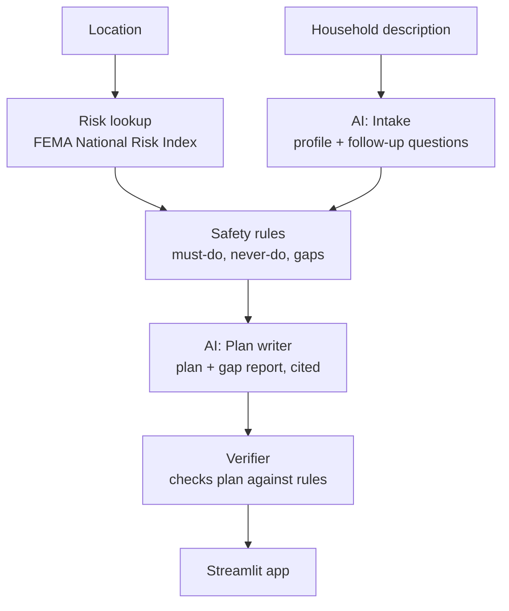

# StormSignal

**Disaster preparedness plans that fit your household, not just the average one.**

ForgeHacks 2026 · AI + Climate track

> Demo video: _[link]_ · Live app: _[link]_

---

## The problem

Official disaster advice is written for an "average" household: *go to the basement, drive out of the area, keep a 72-hour kit.* That advice fails many people: someone in a 3rd-floor apartment, a wheelchair user, a person whose oxygen machine needs power, or a household without a car. These are often the people most at risk when disaster strikes, and as climate change makes extreme weather more frequent, the gap keeps growing.

## What StormSignal does

1. You enter your **location** and **describe your household in your own words.**
2. StormSignal finds the **biggest disaster risks where you live**.
3. It gives you a **personal preparedness plan** for those risks and a **ranked list of your biggest gaps**: what you're missing and how to fix it.

Every recommendation cites an official source.

### Example

> *"I'm 23, live alone on the 3rd floor, and use a powered wheelchair. I don't drive."* — Miami-Dade County, FL

**Top risks:** hurricane, flood, extreme heat

**Your biggest gaps**
1. **No way to evacuate.** You don't drive, and hurricanes often require leaving early. → Register with your county's evacuation assistance program.
2. **No backup charging for your wheelchair.** → Get a backup battery or identify a nearby place to recharge.
3. **No one checks on you.** → Set up a daily check-in with a neighbour during heat alerts.

## How it works



| Step | Type | What it does |
|---|---|---|
| Risk lookup | Code | Finds the county's top hazards in FEMA's National Risk Index |
| Intake | AI | Turns a free-text description into a structured profile and asks follow-up questions relevant to the local risks |
| Safety rules | Code | Hand-written rules from official sources decide what the household must do, must never do, and what they're missing |
| Plan writer | AI | Writes a clear, personal plan and gap report using only the rules' output and cited guidance |
| Verifier | Code | Confirms every required action is present and no forbidden action appears; falls back to the plain rules list if a check fails |

### Why the AI doesn't decide what's safe

The AI does two jobs that code can't: **understanding how real people describe their lives**, and **explaining a plan clearly to that person.** What counts as safe comes from tested rules based on official guidance, and code checks every AI-written plan against those rules before it's shown.

## Hazards covered

| Hazard | Status |
|---|---|
| Hurricane | ✅ |
| Flood | ✅ |
| Extreme heat | ✅ |
| Earthquake | ✅ (preparation) |
| Landslide | 🔜 Planned |

## Tech stack

- **Python** with **Streamlit** for the web app
- **Groq** (open-weight `gpt-oss-120b` model) via the `groq` Python client
- **Pydantic** to validate AI output
- **FEMA National Risk Index** for location risk data
- **pytest** for the safety rules

## Project structure

```
├── app.py                  # Streamlit app: streamlit run app.py
├── stormsignal/
│   ├── risk/               # Module 1: location → top hazards (FEMA National Risk Index)
│   │   └── data/           #   NRI county data (download_nri.py refreshes it)
│   ├── intake/             # Module 2 (AI): description → household profile + follow-up questions
│   ├── rules/              # Module 3: safety rules → must do / never do / gaps / sources
│   ├── plan/               # Module 4 (AI): rules output → personal plan
│   └── verifier/           # Module 5: checks the plan against the rules, falls back if unsafe
├── frontend/               # Module 6: Streamlit screens (api_stub.py connects the modules)
├── samples/                # Example inputs and outputs for each module, UI mock data
├── tests/                  # All tests: python -m pytest
├── docs/                   # Test personas
└── scripts/check_groq.py   # Checks your API key works
```

## Getting started

```bash
git clone https://github.com/devarshi-ap/Forgehacks-2026-Project.git
cd Forgehacks-2026-Project
python -m venv .venv
source .venv/bin/activate        # Windows: .venv\Scripts\activate
pip install -r requirements.txt
```

Create a `.env` file in the project folder (never commit it):

```
GROQ_API_KEY=your_key_here
GROQ_MODEL=openai/gpt-oss-120b
```

Run the app:

```bash
streamlit run app.py
```

Run the tests (no API key or internet needed):

```bash
python -m pytest
```

Try each module on its own:

```bash
python -m stormsignal.risk "Miami, FL"                                  # Module 1 (needs internet)
python -c "from stormsignal.intake import analyze_household as a; print(a('I live alone and use a wheelchair.'))"   # Module 2 (needs key)
python -m stormsignal.rules samples/rules/miami_wheelchair.json        # Module 3
python -c "import json; from stormsignal.plan import build_plan; print(build_plan(json.load(open('samples/plan/module4_input_example.json')))['markdown'])"   # Module 4
python -m stormsignal.verifier samples/verifier/good_plan.md samples/verifier/rules_example.json   # Module 5
python scripts/check_groq.py                                            # check your API key
```

## Testing

We test StormSignal against a set of personas, including people whose needs the safety rules don't cover.

| Test | Result |
|---|---|
| Plans containing every required safety action | _x / y_ |
| Plans containing no forbidden actions | _x / y_ |
| Uncovered needs detected by the AI | _x / y_ |

## Privacy

Household details are kept only for the current session and are never stored. The AI receives a summary of needs (e.g., "power-dependent medical device") rather than raw medical details.

## Limitations

- StormSignal does not replace official instructions. **Always follow evacuation orders and local emergency officials.**
- Location risk data currently covers U.S. counties only.
- AI-suggested advice for needs outside our rules is clearly labeled and should be confirmed with a doctor or local emergency services.

## Next steps

- Live weather alerts that update the plan when a warning is issued
- Canadian location support
- Voice input for people who can't easily type
- Printable plan for the fridge

## Sources

- [FEMA National Risk Index](https://hazards.fema.gov/nri/)
- [Ready.gov](https://www.ready.gov/)
- [CDC Emergency Preparedness](https://www.cdc.gov/)
- [American Red Cross](https://www.redcross.org/get-help/how-to-prepare-for-emergencies.html)

## Team

- _Name_ — role
- _Name_ — role
- _Name_ — role
- _Name_ — role